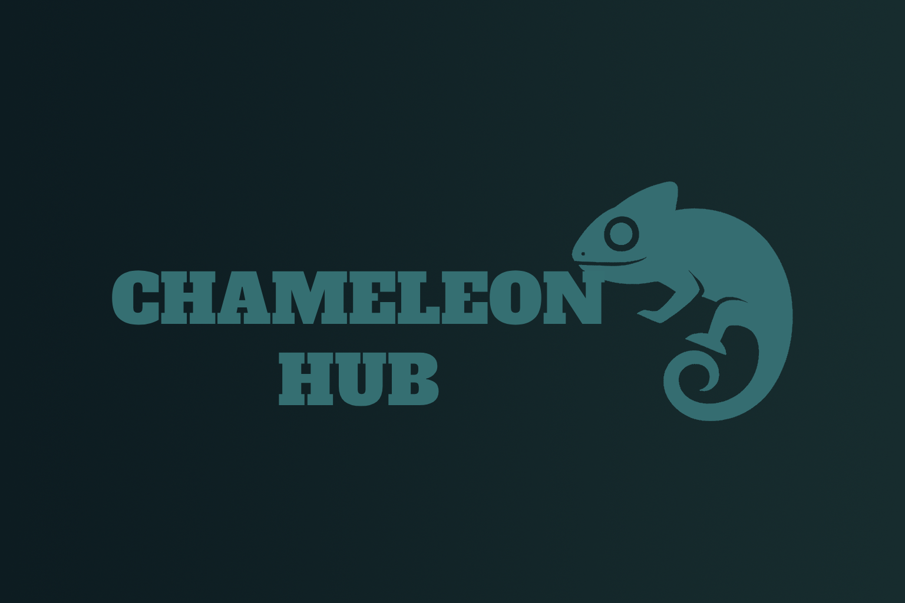

# 🦎 Chameleon Hub

**Chameleon hub** is a modding tool intended for **Chameleon engine game** modding designed to provide editing and inspecting capabilities for the game files. It allows modders to explore, extract and override files, models, textures and configuration data without the need to manually extract the archives.

<p>
  
</p>

<p>
  
  
  
</p>

<p align="center">
  <b>A modern modding hub for Chameleon Engine games</b>
</p>

---

## ✨ Features
- Load and browse `.bndl` and `.dat` files directly from the game directory
- View/search content of said archives by name or ASCII content (WIP)
- Spoof names on files for easier search and movement in the program (Planned)
- Texture, model and sound extraction (Planned)

---

## 🛠 Built With
- 🖥 **.NET Framework 4.8** - Application framework
- 🖱 **WPF** - for interface
- 🗂 **C#** - Programing language used
- 🖼 **WpfHexEditor** - For Binary editing
- 💻 **Windows** - Targeted platform

---


## 🛠 Getting Started

1. Clone the repository:
   ```bash
   git clone https://github.com/RevMods3D/Chameleon-Hub.git
   
---

## If you enjoy my work, consider tipping!

<p align="center">
  <a href="https://ko-fi.com/W7W21HVB2N" target="_blank">
    
  </a>
</p>
